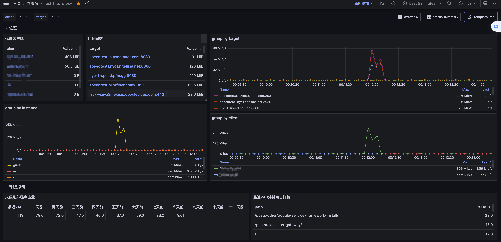

基于 `hyper` 和 `rustls` 的http代理。

整体功能完全对标[Java版本HttpProxy](https://github.com/arloor/HttpProxy)。 内存仅为Java版本的十分之一，为20MB以下。

相比 `hyper`的[正向代理example](https://github.com/hyperium/hyper/blob/0.14.x/examples/http_proxy.rs)增加了以下特性：

1. proxy over tls特性( `--over-tls` )：使用tls来对代理流量进行加密。
2. 每天定时加载tls证书，acme证书过期重新签发时不需要重启服务。
3. 支持Proxy-Authorization鉴权。
4. 开启Proxy-Authorization鉴权时，结合 `--never-ask-for-auth` 配置防止嗅探。
5. 删除代理相关的header，以保持高匿。
6. 类Nginx的静态资源托管，支持gzip压缩。
7. 基于Prometheus的可观测，可以监控代理的流量、外链访问等。
8. 支持多端口，多用户。
9. 连接空闲（2分钟没有IO）自动关闭。

提及的参数详见[命令行参数](#命令行参数)

## 命令行参数

```shell
$ rust_http_proxy --help
A HTTP proxy server based on Hyper and Rustls, which features TLS proxy and static file serving

Usage: rust_http_proxy [OPTIONS]

Options:
      --log-dir <LOG_DIR>
          [default: /tmp]
      --log-file <LOG_FILE>
          [default: proxy.log]
  -p, --port <PORT>
          可以多次指定来实现多端口
           [default: 3128]
  -c, --cert <CERT>
          [default: cert.pem]
  -k, --key <KEY>
          [default: privkey.pem]
  -u, --users <USER>
          默认为空，表示不鉴权。
          格式为 'username:password'
          可以多次指定来实现多用户
           [default: ]
  -w, --web-content-path <WEB_CONTENT_PATH>
          [default: /usr/share/nginx/html]
  -r, --referer <REFERER>
          Http Referer请求头处理 
          1. 图片资源的防盗链：针对png/jpeg/jpg等文件的请求，要求Request的Referer header要么为空，要么配置的值
          2. 外链访问监控：如果Referer不包含配置的值，并且访问html资源时，Prometheus counter req_from_out++，用于外链访问监控
           [default: ]
      --never-ask-for-auth
          if enable, never send '407 Proxy Authentication Required' to client。
          建议开启，否则有被嗅探的风险
          
  -o, --over-tls
          if enable, proxy server will listen on https
      --hostname <HOSTNAME>
          [default: 未知]
  -h, --help
          Print help
```

**SSL配置**

其中，tls证书(`--cert`)和pem格式的私钥(`--key`)可以通过openssl命令一键生成：

```shell
openssl req -x509 -newkey rsa:4096 -sha256 -nodes -keyout /usr/share/rust_http_proxy/privkey.pem -out /usr/share/rust_http_proxy/cert.pem -days 3650 -subj "/C=cn/ST=hl/L=sd/O=op/OU=as/CN=example.com"
```

如需签名证书，请购买tls证书或免费解决方案（acme.sh等）

**测试TLS Proxy**

可以使用curl （7.52.0以上版本）来测试

```shell
curl  https://ip.im/info --proxy-user "username:password" -x https://localhost:7788  --proxy-insecure
```

## 安装说明

### linux amd64 可执行文件

> 通过Github Action自动更新release，永远是最新版，可放心使用

```shell
curl -SLfO https://github.com/arloor/rust_http_proxy/releases/download/v1.0.0/rust_http_proxy
mv rust_http_proxy /usr/bin/rust_http_proxy&&chmod +x /usr/bin/rust_http_proxy
rust_http_proxy -h
```

### Docker 安装 

> 通过Github Action自动更新release，永远是最新版，可放心使用

```shell
docker run --rm -it --name proxy --net host docker.io/arloor/rust_http_proxy
```

## 可观测

### Linux运行时的网速监控

在linux运行时，会监控网卡网速，并展示在 `/speed` 。


### Prometheus Exporter

提供了Prometheus的Exporter

```text
# HELP req_from_out Number of HTTP requests received.
# TYPE req_from_out counter
req_from_out_total{referer="all",path="all"} 4
# HELP proxy_traffic num proxy_traffic.
# TYPE proxy_traffic counter
# EOF
```

可以使用[此Grafana大盘Template](https://grafana.com/grafana/dashboards/20185-rust-http-proxy/)来创建Grafana大盘，效果如下



## 客户端
 
可以使用clash作为客户端，见：

- [clash for windows](https://github.com/Fndroid/clash_for_windows_pkg/releases)
- [clashX pro](https://install.appcenter.ms/users/clashx/apps/clashx-pro/distribution_groups/public)
- [ClashForAndroid](https://github.com/Kr328/ClashForAndroid/releases)

## 高匿实现

代理服务器收到的http请求有一些特征，如果代理服务器不能正确处理，则会暴露自己是一个代理。高匿代理就是能去除这些特征的代理。具体特征有三个：

- 代理服务器收到的request line中有完整url，即包含schema、host。而正常http请求的url只包含路径
- 代理服务器收到http header中有Proxy-Connection请求头，需要去掉
- 代理服务器收到http header中有Proxy-Authentication请求头，需要去掉

本代理能去除以上特征。下面是使用tcpdump测试的结果，分别展示代理服务器收到的http请求和nginx web服务器收到的http请求已验证去除以上特征。

代理服务器收到的消息：


Nginx收到的消息：


可以看到请求URL和`Proxy-Connection`都被正确处理了。


## 一些例子

- [tls-listener example](https://github.com/tmccombs/tls-listener/blob/main/examples/http.rs)
- [tls-listener change-certificate](https://github.com/tmccombs/tls-listener/blob/main/examples/http-change-certificate.rs)
- [hyper example http_proxy](https://github.com/hyperium/hyper/blob/master/examples/http_proxy.rs)
- [rustls async Acceptor for hyper v0.14](https://github.com/rustls/hyper-rustls/blob/286e1fa57ff5cac99994fab355f91c3454d6d83d/src/acceptor.rs)
- ~~[rustls async Acceptor for hyper v1](https://github.com/Gelbpunkt/hyper-rustls/blob/3d88d7d76c2e91e39b028dbbb92db917aa051092/src/acceptor.rs)已删除~~ [Update hyper to 1.x and integrate with hyper-util #232](https://github.com/rustls/hyper-rustls/pull/232#issuecomment-1878924476)的PR中hyper-rustls已删除tls acceptor，因为无必要