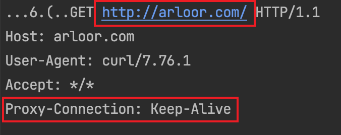
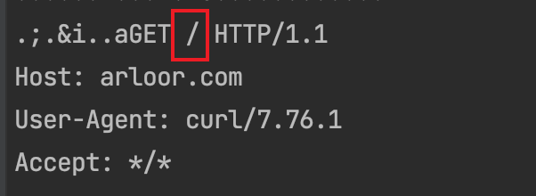
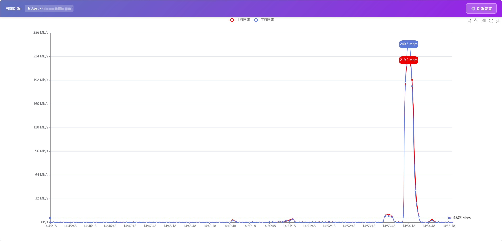

基于 `hyper` 、 `tls-listener ` 和 `rustls` 的http代理。

整体功能完全对标[Java版本HttpProxy](https://github.com/arloor/HttpProxy)。 内存仅为Java版本的十分之一，为20MB以下。

相比 `hyper`的[正向代理example](https://github.com/hyperium/hyper/blob/0.14.x/examples/http_proxy.rs)增加了以下特性：

1. proxy over tls特性( `over_tls=true` )：使用tls来对代理流量进行加密。
2. 每天定时加载tls证书，acme证书过期重新签发时不需要重启服务。
3. 支持Proxy-Authorization鉴权。
4. 开启Proxy-Authorization鉴权时，结合 `ask_for_auth=false` 配置防止嗅探。
5. 删除代理相关的header，以保持高匿。
6. 类Nginx的静态资源托管，可以搭建静态网站。

提及的参数详见[高级配置](#高级配置)

## 运行

```shell
cargo run --package rust_http_proxy --bin rust_http_proxy
```

## 高级配置

通过环境变量进行配置，相关环境变量及其默认值：

```shell
# 监听的端口
export port=3128
# 默认为空，表示不鉴权。格式为 "Basic Base64Encode(username:password)"，注意username和password用英文冒号连接再进行Base64编码（RFC 7617）。
# 例如 Basic dXNlcm5hbWU6cGFzc3dvcmQ= 
# 这由此命令生成： echo -n "username:passwrod" | base64
export basic_auth=
# 主动发起Proxy-Authenticate。在公网下推荐设置为false。
export ask_for_auth=true
# 是否使用tls，默认为http
export over_tls=false
# tls证书
export cert=cert.pem
# 私钥 pem格式
export raw_key=privkey.pem
# 日志文件路径，默认为/tmp/proxy.log
export log_dir=/tmp
export log_file=proxy.log
# 代替nginx的web服务器功能，展示http网站
export web_content_path=/usr/share/nginx/html
# png/jpeg/jpg等图片资源的防盗链配置，要求Request的Referer header要么为空，要么包含下面的值
export refer=

```

其中，tls证书(`cert`)和pem格式的私钥(`raw_key`)可以通过openssl命令一键生成：

```shell
openssl req -x509 -newkey rsa:4096 -sha256 -nodes -keyout /usr/share/rust_http_proxy/privkey.pem -out /usr/share/rust_http_proxy/cert.pem -days 3650 -subj "/C=cn/ST=hl/L=sd/O=op/OU=as/CN=example.com"
```

如需签名证书，请购买tls证书或免费解决方案（acme.sh等）

## 安装说明

### Docker 安装

```shell
docker run --rm -it --name proxy --net host docker.io/arloor/rust_http_proxy
```

### rpm包安装：

**安装：**

```shell
version=0.1
release=1.all
wget https://github.com/arloor/rust_http_proxy/releases/download/v1.0.0/rust_http_proxy-"${version}"-"${release}".x86_64.rpm -O rust_http_proxy-"${version}"-"${release}".x86_64.rpm
systemctl stop rust_http_proxy
yum remove -y rust_http_proxy
# rpm -ivh在安装新版本时会报错文件冲突，原因是他没有进行更新或降级的能力，而yum install可以处理可执行文件的更新或降级
yum install -y rust_http_proxy-"${version}"-"${release}".x86_64.rpm
## 启动
systemctl daemon-reload
systemctl start rust_http_proxy 
journalctl -exfu rust_http_proxy
```

**卸载：**

```shell
service rust_http_proxy stop
yum remove -y rust_http_proxy
```

### linux 64位可执行文件

```shell
wget https://github.com/arloor/rust_http_proxy/releases/download/v1.0.0/rust_http_proxy -O /tmp/rust_http_proxy.bin
mv  /tmp/rust_http_proxy.bin /usr/bin/rust_http_proxy #避免text file is busy的问题
chmod +x /usr/bin/rust_http_proxy
/usr/bin/rust_http_proxy
```

## 客户端

可以使用clash作为客户端，见：

- [clash for windows](https://github.com/Fndroid/clash_for_windows_pkg/releases)
- [clashX pro](https://install.appcenter.ms/users/clashx/apps/clashx-pro/distribution_groups/public)
- [ClashForAndroid](https://github.com/Kr328/ClashForAndroid/releases)

## 高匿实现

代理服务器收到的http请求有一些特征，如果代理服务器不能正确处理，则会暴露自己是一个代理。高匿代理就是能去除这些特征的代理。具体特征有三个：

- 代理服务器收到的request line中有完整url，即包含schema、host。而正常http请求的url只包含路径
- 代理服务器收到http header中有Proxy-Connection请求头，需要去掉
- 代理服务器收到http header中有Proxy-Authentication请求头，需要去掉

本代理能去除以上特征。下面是使用tcpdump测试的结果，分别展示代理服务器收到的http请求和nginx web服务器收到的http请求已验证去除以上特征。

代理服务器收到的消息：



Nginx收到的消息：



可以看到请求URL和`Proxy-Connection`都被正确处理了。

## 可观测性

### Linux运行时的网速监控

在linux运行时，会监控网卡网速，并展示在 `/speed` 。



### Prometheus Exporter

在 `/metrics`

```text
# HELP req_from_out Number of HTTP requests received.
# TYPE req_from_out counter
req_from_out_total{referer="all",path="all"} 4
# HELP proxy_access num proxy_access.
# TYPE proxy_access counter
# EOF
```
