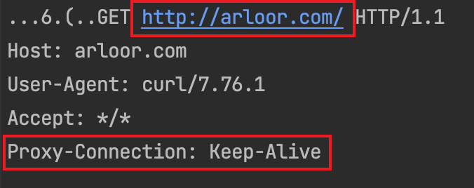
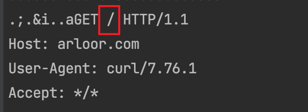

# 高匿代理实现

高匿代理（Elite Proxy）是指能够完全隐藏自身代理身份的代理服务器。本项目完整实现了高匿代理特性。

## 代理特征清除

普通代理服务器收到的 HTTP 请求具有以下特征，本项目已全部处理：

1. **完整 URL 格式**
   - ❌ 普通代理：Request Line 包含完整 URL（schema + host + path）
   - ✅ 高匿处理：转换为仅包含路径的标准格式

2. **Proxy-Connection 请求头**
   - ❌ 普通代理：保留 `Proxy-Connection` 头
   - ✅ 高匿处理：自动删除

3. **Proxy-Authorization 请求头**
   - ❌ 普通代理：保留 `Proxy-Authorization` 头
   - ✅ 高匿处理：自动删除

## 验证测试

使用 tcpdump 抓包验证，对比代理服务器和上游服务器收到的请求：

**代理服务器收到的原始请求**：

**上游 Nginx 服务器收到的处理后请求**：

✅ **验证结论**：Request URL 已转换为标准路径格式，`Proxy-Connection` 等代理特征头已被移除。
