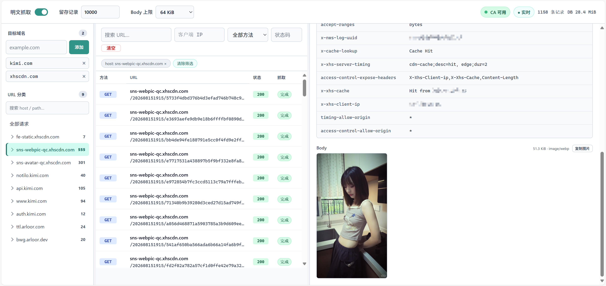

# HTTPS MITM

MITM 默认关闭。配置 `--mitm-domain-suffix` 后，只有命中后缀的 `CONNECT` 请求会进入 MITM；其它 HTTPS 请求仍按普通隧道转发。进入 MITM 后，代理会与客户端建立 TLS，使用指定 CA 动态签发目标域名证书，再把解密后的 HTTP 请求转发到真实 HTTPS 上游。

```bash
# 生成测试 CA
openssl req -x509 -newkey rsa:4096 -sha256 -nodes \
  -keyout mitm-ca-key.pem \
  -out mitm-ca-cert.pem \
  -days 3650 \
  -subj "/CN=rust_http_proxy MITM CA"

# 启动 MITM 正向代理
rust_http_proxy -p 7788 \
  --mitm-domain-suffix example.com \
  --mitm-domain-suffix example.org \
  --mitm-dump \
  --mitm-ca-cert mitm-ca-cert.pem \
  --mitm-ca-key mitm-ca-key.pem
```

客户端需要信任 `mitm-ca-cert.pem`，否则 HTTPS 校验会失败。请只在你有权限解密和代理的流量上使用该功能。

## MITM 管理与实时明文查看

程序始终创建 MITM SQLite 数据库（默认 `<log-dir>/mitm.sqlite3`），React 管理面板内嵌在可执行文件中，可通过 `http(s)://代理地址/mitm` 访问。面板、静态资源、API 和实时 SSE 均使用 `--mitm-users` 配置的 Basic 账号认证；未指定 `--mitm-users` 时回退到 `--users`。未配置账号时 `/mitm` 始终返回 `401`。如果面板主机名本身也命中 MITM 目标，`/mitm` 管理请求不会写入抓取记录，避免把留存窗口挤满。

```bash
rust_http_proxy -p 7788 \
  --mitm-users admin:change-me \
  --mitm-ca-cert mitm-ca-cert.pem \
  --mitm-ca-key mitm-ca-key.pem \
  --mitm-db-file /var/lib/rust_http_proxy/mitm.sqlite3
```

面板支持：

- MITM 直接由目标域名后缀列表控制：存在已启用目标且 CA 可用时，命中的新 CONNECT 会进入 MITM；删除或停用目标不影响已经建立的连接。
- 查看本进程最近 200 条普通代理请求，并从单条请求中选择不同域名后缀级别加入目标；例如 `api.example.com` 可选择精确主机或 `example.com`。
- 动态增删域名后缀，也可单独停用而不删除；停用状态随控制台目标持久化。`example.com` 同时匹配 `example.com` 与其子域名。
- 按域名、路径、客户端 IP、方法、状态码和关键字查看最近请求；请求与响应 headers/body 使用同一个记录 ID 关联。
- 实时显示流式响应。关闭抓取后，在途记录会保留已经捕获的部分并标记为 `capture_stopped`；客户端提前断开、body 未传输完的记录会标记为 `interrupted`（重启时历史 `capturing` 记录也会统一收尾为该状态）。204 / `Content-Length: 0` / 已 `END_STREAM` 的空响应即使下游不再 poll body，也会记为 `complete`。
- 默认保留最近 10,000 条记录，请求与响应 body 分别最多保存 64 KiB；可在面板中调整。

本地开发面板时，可在 `mitm-ui` 目录启动 Vite，并把 API / CA 代理到正在运行的代理进程。`EventSource` 无法自定义请求头，所以 Basic 认证需要由 Vite 注入：

```bash
cd mitm-ui
MITM_DEV_PROXY_TARGET=https://127.0.0.1:444 MITM_DEV_PROXY_USER=admin:change-me npm run dev
```

然后打开 `http://127.0.0.1:5173/mitm/`。目标地址若使用自签证书，开发代理会跳过证书校验。



命令行中的 `--mitm-domain-suffix` 目标会在面板中标记为“启动参数”，不能通过 API 或控制台删除；它们只在本次运行中生效。控制台新增的目标持久保存在 SQLite 中，若与启动参数重名则在本次运行中同样被锁定。“明文抓取”开关也保存在 SQLite 中，未传 `--mitm-dump` 时使用数据库中的持久化设置。传入 `--mitm-dump` 会在本次运行中强制开启抓取，并锁定控制台与 API 中的该开关；需要移除启动参数并重启后才能再次修改。该运行时覆盖不会改写已有数据库中的开关值，并且明文不会输出到普通日志。请求和响应的 `gzip`、`deflate`、`br`、`zstd` 以及多层 `Content-Encoding` 会在旁路解压后展示；二进制内容、WebSocket 数据帧和不支持的压缩格式不会保存 body，详情中会显示跳过原因。

> ⚠️ **安全提示**：记录会完整保存 `Authorization`、`Cookie`、`Set-Cookie` 等敏感头。Basic 认证本身不加密凭据，管理面板应使用 `--over-tls`、反向代理 TLS 或仅在可信网络监听，并妥善保护 SQLite 文件。

Docker 运行时请挂载数据库目录，否则容器删除后记录和动态配置会丢失：

```bash
docker run --rm --net host \
  -v /srv/rust_http_proxy:/data \
  quay.io/arloor/rust_http_proxy -p 7788 \
  --mitm-users admin:change-me \
  --mitm-db-file /data/mitm.sqlite3 \
  --mitm-ca-cert /data/mitm-ca-cert.pem \
  --mitm-ca-key /data/mitm-ca-key.pem
```

## MITM Stub 响应

面板顶部的 **Stub 规则** 可查看配置文件规则，并新建、编辑、启停和删除 UI 规则。请求详情中的“为此请求创建 Stub”会预填域名和路径。

- **匹配顺序**：先匹配配置文件，未命中时才匹配已启用的 UI 规则，否则访问原始上游。响应覆写和上游转发按 CONNECT 的 `host:port` 与请求路径精确匹配，忽略 query；mod-header 使用下述完整 URL 正则，均适用于所有 HTTP 方法；例如 `api.example.com:443` + `/api/profile`。
- **文件优先**：命中后选择整条文件规则，不再叠加 UI 的 Body 或 Header 操作。同域名、同路径的 UI 规则可以保存，但显示“被文件规则覆盖”。文件规则只读，修改 YAML 或 `body_file` 后需要重启；UI 不会改写它们。
- **持久化**：UI 规则保存在 `--mitm-db-file` 指定的 SQLite 中，保存后对后续请求生效（包括已建立 MITM 连接内的新请求），重启后保留。清空抓取记录不会删除规则。每个精确域名和路径组合、或同一 URL 正则最多一条 UI 规则，总计最多 1000 条。
- **覆写响应**：直接编写 Body 原文，无需上传文件。支持空 Body，最多 1 MiB；状态码为 200–599，204 / 205 / 304 不允许非空 Body。`HEAD` 不返回正文。`Content-Length` 自动计算，`Content-Type` 可通过响应头设置。静态响应不访问上游，请求头修改仅体现在抓取记录中。
- **转发上游**：填写 HTTP/HTTPS URL，原始路径和 query 追加到 URL 前缀后，沿用配置文件中 URL 简写的虚拟主机与 H1 行为。详细的 H2、SNI、连接目标等上游选项继续通过 YAML 配置。
- **mod-header（URL 正则）**：仅修改请求/响应头，保留原始上游、状态码和 Body。针对完整 HTTPS URL（含路径、query，默认 `:443` 省略，非默认端口保留）使用 Rust 正则匹配，例如 `^https://api\.example\.com/(users|items)/[0-9]+\?debug=1$`。正则默认区分大小写，可使用 `(?i)`；未使用 `^` / `$` 时允许部分匹配。保存时校验并编译，重启后自动恢复，非法或空表达式不能保存。UI 规则按创建顺序使用第一条命中规则，文件规则仍然优先；已有的“仅修改 Headers”精确匹配规则继续兼容。两侧都支持逐行“增加”（追加一个同名值）、“覆盖”（替换全部同名值）、“删除”（移除全部同名值），按行顺序执行，不区分头名称大小写；最多 100 项操作。Host、Content-Length、Transfer-Encoding、Connection、Upgrade、TE、Trailer、Keep-Alive 和代理认证/连接头由 HTTP 传输层管理，UI 规则不能改写。
- **来源标记**：Request / Response 详情显示 `mitm-stub · 配置文件 / UI 规则`，区分覆写 Body、替代上游和原始服务，标记修改过的 Header，并列出删除操作。来源快照随抓取记录保存，后续编辑或删除规则不会改变历史标记。升级前已有的记录没有来源快照，不会根据当前规则推断来源。

规则生效仍需配置 CA 并启用对应的 MITM 目标域名。关闭明文抓取只停止记录，不会停用 Stub 规则。


通过 `--mitm-stub-config-file` 可以让 MITM 在转发真实上游前按 `authority + path` 命中 stub。每条规则必须二选一：使用 `body_file` 返回本地静态响应，或使用 `upstream` 动态生成响应。

```bash
rust_http_proxy -p 7788 \
  --mitm-domain-suffix knowhub.cloud \
  --mitm-ca-cert mitm-ca-cert.pem \
  --mitm-ca-key mitm-ca-key.pem \
  --mitm-stub-config-file mitm-stubs.yaml
```

```yaml
adminmaxapi.knowhub.cloud:443:
  # 静态 stub
  - path: /access-tokens/validate
    status: 200 # 可选，默认 200
    headers:
      content-type: application/json
    body_file: responses/knowhub-validate.json

  # 动态 stub
  - path: /users/current
    upstream: http://127.0.0.1:9010/stub

  # 动态 stub 的完整 upstream 配置
  - path: /users/detail
    upstream:
      url_base: https://stub.internal/stub
      connect_to: 10.0.0.20:8443
      tls_server_name: stub.internal
      authority: "#{host}"
      version: AUTO
      headers:
        X-Stub-Source: mitm
```

静态 stub 的 `body_file` 支持相对路径，相对配置文件所在目录解析；程序会按 body 实际长度写入 `Content-Length`，不会自动 gzip/br/deflate 压缩。

动态 stub 的 `upstream` 可以使用 `http://` 或 `https://` URL 字符串，也可以使用与反向代理相同的完整 upstream 对象；两种形式都不能在 `url_base` 中包含 query。完整对象支持 `H1`/`H2`/`AUTO`、静态的 `connect_to`/`tls_server_name`、`authority` 和请求头覆盖，字段语义与[反向代理 upstream](reverse-proxy.md#upstream-配置项说明) 完全相同。字符串简写保持兼容行为：固定使用 H1，并以原请求 Host 作为上游 Host。

命中后，程序把已卸载 TLS 的原请求（method、headers、body、path 和 query）发送给该 upstream，并把 upstream 的 status、headers 和流式 body 通过现有 MITM TLS 连接返回客户端。SSE (`text/event-stream`) 会逐事件流式返回；WebSocket 请求在 upstream 返回 `101 Switching Protocols` 后会建立双向隧道，且要求最终选择 H1。`upstream` 中的路径作为前缀，例如上面的 `/users/current?verbose=1` 会转发到 `http://127.0.0.1:9010/stub/users/current?verbose=1`。完整对象未配置 `authority` 时默认使用 `url_base` 的 authority；需要保留原请求虚拟主机时可显式设置 `authority: "#{host}"`。

`responses/knowhub-validate.json`:

```json
{
  "ok": true,
  "status": "enabled",
  "owner": "mitm",
  "expire_at": 0,
  "user_ok": true,
  "user_status": "free",
  "user_expire_at": 0
}
```
