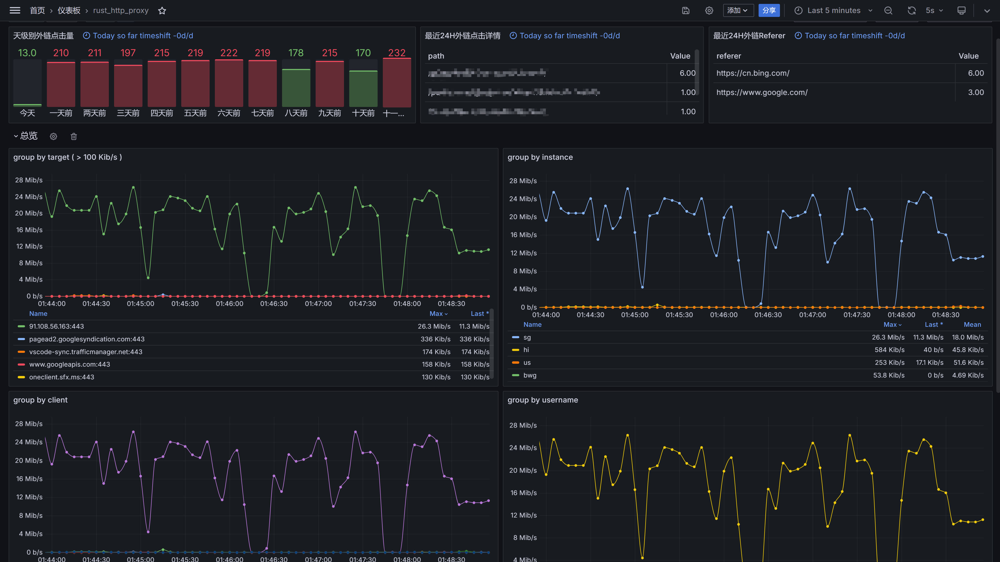
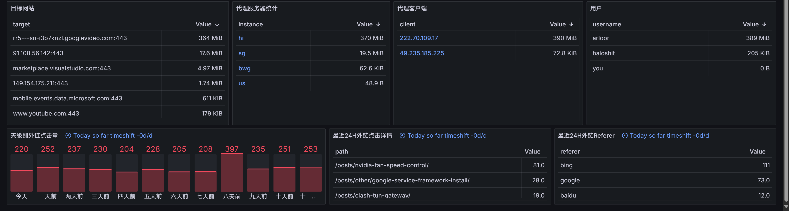
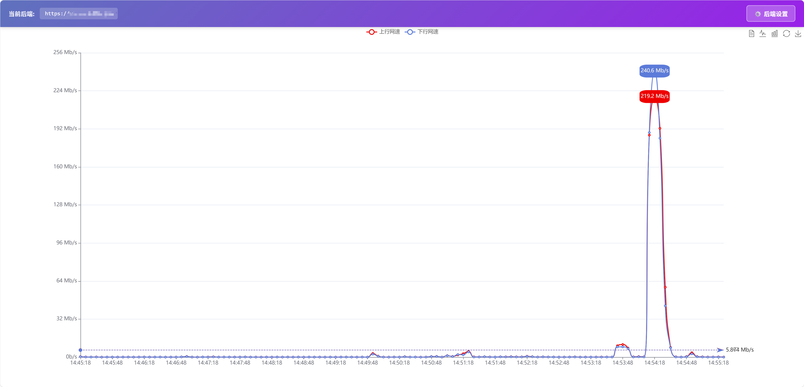

# 可观测性与监控

## Prometheus Metrics

本项目内置 Prometheus Exporter，通过 `/metrics` 端点暴露指标。

> ⚠️ **注意**：如果设置了 `--users` 参数，访问 `/metrics` 时需要在 HTTP Header 中提供 Authorization，否则返回 `401 UNAUTHORIZED`。

### 示例指标

```prometheus
# HELP req_from_out Number of HTTP requests received.
# TYPE req_from_out counter
req_from_out_total{referer="all",path="all"} 4

# HELP proxy_traffic num proxy_traffic.
# TYPE proxy_traffic counter
proxy_traffic_total 1048576
# EOF
```

Linux 环境还会导出当前进程所在 cgroup 的 CPU 和内存指标。内存相关的主要指标包括：

| 指标                                              | 说明                                                                 |
| ------------------------------------------------- | -------------------------------------------------------------------- |
| `cgroup_memory_current_bytes`                     | 当前内存使用量                                                       |
| `cgroup_memory_working_set_bytes`                 | 当前使用量减去 inactive file                                         |
| `cgroup_memory_anon_bytes`                        | 匿名内存；cgroup v1 使用最接近的 RSS 口径                            |
| `cgroup_memory_active_file_bytes`                 | 活跃的文件页内存                                                     |
| `cgroup_memory_inactive_file_bytes`               | 非活跃的文件页内存                                                   |
| `cgroup_memory_kernel_bytes`                      | 内核内存；通过 `cgroup_memory_kernel_available` 判断当前内核是否支持 |
| `cgroup_memory_peak_bytes`                        | 历史峰值；通过 `cgroup_memory_peak_available` 判断内核是否支持       |
| `cgroup_memory_limit_bytes`                       | cgroup 硬上限；`cgroup_memory_limit_enabled=0` 表示无限制            |
| `cgroup_memory_collection_success`                | 最近一次内存采集是否成功                                             |
| `cgroup_memory_collection_errors_total`           | 内存采集失败累计次数                                                 |
| `cgroup_memory_last_collection_timestamp_seconds` | 最近一次成功采集的 Unix 时间戳                                       |

CPU 指标也提供对应的 `cgroup_cpu_collection_success`、`cgroup_cpu_collection_errors_total` 和
`cgroup_cpu_last_collection_timestamp_seconds`，因此采集失败时可以识别旧数据，而不会把旧值误认为当前值。

## Grafana 可视化

推荐使用官方提供的 [Grafana Dashboard 模板](https://grafana.com/grafana/dashboards/20185-rust-http-proxy/)，快速搭建监控大盘。

**效果预览**：




## 实时网速监控（Linux）

在 Linux 平台运行时，访问 `/net` 路径可查看实时网卡流量监控。

**效果预览**：



## eBPF 流量统计

可选的 eBPF socket filter 可以进行高性能流量统计，需要使用 `bpf_vendored` feature 编译，详见 [Cargo Features](cargo-features.md#-ebpf-增强推荐)。
